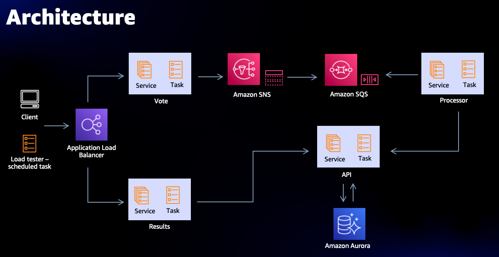
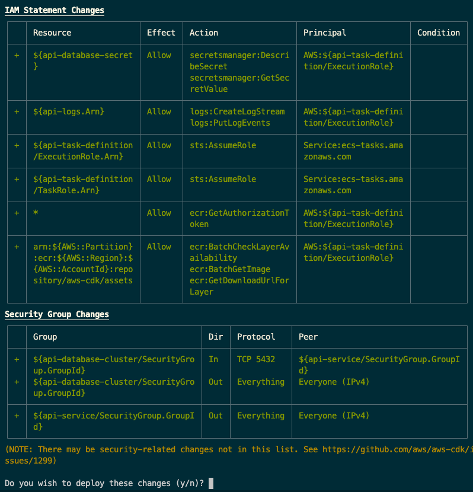

# CDK Workshop

Hello and thank you for joining us! Today, we are going to deploy an application with 4 microservices using AWS CDK, Amazon ECS, and AWS Fargate.

The Pets Voting Application comprises of
* ["vote"](https://github.com/copilot-example-voting-app/vote), a frontend service that renders an HTML page to vote on cats vs. dogs. This publishes the vote request to a SNS topic, and is fronted by an Application Load Balancer.
* ["processor"](https://github.com/copilot-example-voting-app/processor) microservice is subscribed to that SNS topic using a SQS queue. This asynchronously batches the votes and forwards requests to the "api" service.
* ["api"](https://github.com/copilot-example-voting-app/api) microservice stores and retrieve results on whether a voter prefers cats or dogs. This is a REST API microservice orchestrated by Amazon ECS on AWS Fargate, and is backed up an Amazon Aurora PostgreSQL database for storage.
* ["results"](https://github.com/copilot-example-voting-app/results), a frontend service to visualize the results of the votes. This makes a request to the api service to query the votes. Both the results and vote microservices communicate to api through service discovery.



&nbsp;

&nbsp;

## Access your AWS account

First let's access the temporary AWS account that you will be given for this workshop.

Open up the AWS Event Engine portal: [https://dashboard.eventengine.run/](https://dashboard.eventengine.run/)


You need to enter the event hash that you were provided by the event organizers. This will open up the Event Engine dashboard. Then from the dashboard you can click to open the AWS Console.

<details>
  <summary>Show me how to do it</summary>

  

  Click on the "AWS Console" button.

  

  Then click on "Open AWS Console".

  You will be logged in to the AWS Console of a temporary AWS account that you can use for the duration of this workshop:

  
</details>

&nbsp;

&nbsp;

## Load up the cloud development environment

In the search bar at the top of the AWS Console type "Cloud9" and click on the "Cloud9" service when it appears. This will open up the service console for accessing a cloud development environment.

You will see a preprepared development environment that you will use for the rest of this workshop/

<details>
  <summary>Show me how to do it</summary>


Click on the "Open IDE" button to access your development environment. You may see an
interstitial screen similar to this one for a minute or two:


</details>

Next we need to make a few customizations to the dev environment:

Once the development environment opens up click on the settings button in the upper right corner:


Then select "AWS Settings" and ensure that the "AWS managed temporary credentials" settings is off (red).


This workshop will be using an automatically created IAM role that is attached to the Cloud9 development environment, rather than the default Cloud9 temporary credentials.

Now the development environment is ready to go, so we just need to open up a terminal to run commands in.

<details>
  <summary>Show me how to do it</summary>

  
</details>

Copy and paste the following quick script into the terminal, and run it to customize the AWS config inside of the development environment:

```sh
# Install prerequisites
sudo yum install -y jq

# Setting environment variables required to communicate with AWS API's via the cli tools
echo "export AWS_DEFAULT_REGION=$(curl -s 169.254.169.254/latest/dynamic/instance-identity/document | jq -r .region)" >> ~/.bashrc
source ~/.bashrc

mkdir -p ~/.aws

cat << EOF > ~/.aws/config
[default]
region = ${AWS_DEFAULT_REGION}
output = json
role_arn = $(aws iam get-role --role-name ecsworkshop-admin | jq -r .Role.Arn)
credential_source = Ec2InstanceMetadata
EOF
```

Now we need to make sure that the latest version of AWS Cloud Development Kit inside of the Cloud9 development environment.

Run `cdk` to ensure that AWS Cloud Development Kit is preinstalled in this environment. If not try following the [official getting started docs on how to install AWS CDK](https://docs.aws.amazon.com/cdk/latest/guide/getting_started.html).

<details>
  <summary>Give me a hint</summary>

  * Install the AWS CDK command line tool from NPM (note that the Cloud9 development environment already has CDK installed, but it may not be the latest version)
  * Verify that the CDK command line tool is available
  * Run a CDK Bootstrap command to setup CDK on the AWS account
</details>
<details>
  <summary>Show me how to do it</summary>

  ```
    npm upgrade -g aws-cdk
    cdk --version
    cdk bootstrap aws://{ACCOUNT}/us-west-2
  ```

  You can get your account ID from the AWS console by clicking the dropdown in the upper right:

  
</details>

&nbsp;

&nbsp;

## Start your Cloud Development Kit project

As you go through the workshop you will see three levels to each step:

* __"Give me a challenge"__ may be fun for you if you are already a very advanced user of AWS CDK and familiar with TypeScript. The challenge will give you the high level goals of this step and links to the docs. You can try to write the code to solve the challenge by yourself if you wish.
* __"Show me how to do it"__ will give you code that you can copy and paste to solve this step. If you aren't familiar with AWS CDK or TypeScript this will be the best option for learning what CDK does and how it works without needing a lot of preexisting knowledge.
* __"Give me the answer"__ is ideal if you are in a hurry or not feeling like doing some coding or typing today. It will give you a prefab project branch to check out and you just have to run the commands to deploy the code quickly and easily. You will learn how to use CDK to deploy applications, but will probably not learn as much about how CDK works under the hood.

The first step is to clone this workshop repo. This clone will serve as a working reference. Run the following command in your Cloud9 terminal:

```
git clone https://github.com/copilot-example-voting-app/cdk-workshop.git sample-workshop
```

No matter which level of steps you choose you can refer to this complete working example code if you get stuck, or copy from in building your own CDK code.

Next we need to create a brand new blank project to use as the starting point for your own CDK application.

```
mkdir cdk-workshop
cd cdk-workshop
cdk init --language typescript
```

For this workshop we will be working in TypeScript. You can find detailed information about using CDK with Typescript in the docs: https://docs.aws.amazon.com/cdk/latest/guide/work-with-cdk-typescript.html

You should now have two top level folders:

* `sample-workshop` is a working reference implementation that you can refer to if you get stuck
* `cdk-workshop` is your own copy, which you will be building out for this workshop.

&nbsp;

&nbsp;

## Learn the basic project structure

First of all the `cdk-workshop/package.json` file is very important because it lists the packages that will be used.

Your CDK project has an entry point at `bin/cdk-workshop.ts`. This file defines the overall application. The application can then be made up of multiple stacks that define different components.

You can find these stacks at `lib` and there is a sample stack at `lib/cdk-workshop-stack.ts`.

The project you are building today is going to be a microservices deployment that has multiple services, so we are going to be creating stacks in the `lib` folder, and then adding those stacks to the application at `bin/cdk-workshop.ts`

&nbsp;

&nbsp;

## Create your first top level stack

Let's create a first stack in your CDK project. This is going to be a base stack that will hold shared resources like the VPC, ECS Cluster, and Service Discovery resources.

<details>
  <summary>Give me a challenge</summary>

  * Add the following packages to your project:
    - `"@aws-cdk-containers/ecs-service-extensions": "1.130.0",`
    - `"@aws-cdk/aws-ec2": "1.130.0",`
    - `"@aws-cdk/aws-ecs": "1.130.0",`
    - `"@aws-cdk/aws-rds": "1.130.0",`
    - `"@aws-cdk/core": "1.130.0",`
  * Copy in some prebuilt extensions from the `sample-workshop` that we will use later on:
    - `lib/api-database.ts`
    - `lib/awslogs-extension.ts`
    - `lib/load-balancer.ts`
    - `lib/service-discovery.ts`
  * Create a new CDK stack in `lib` and add it to your entrypoint in `bin`.
  * In the stack create the following CDK resources:
    - AWS VPC
    - ECS Cluster that uses that VPC
    - Add the following service discovery namespace to the ECS Cluster: `voting-app.local`
</details>
<details>
  <summary>Show me how to do it</summary>
Modify the `dependencies` section of the `package.json` file to look like this:

```
"dependencies": {
  "@aws-cdk-containers/ecs-service-extensions": "1.130.0",
  "@aws-cdk/aws-ec2": "1.130.0",
  "@aws-cdk/aws-ecs": "1.130.0",
  "@aws-cdk/aws-rds": "1.130.0",
  "@aws-cdk/core": "1.130.0",
  "source-map-support": "^0.5.16"
}
```
You can also refer to `sample-workshop/package.json` for a reference of what the full `package.json` file should look like.

Make sure you run `npm install` to install the dependencies.

Now copy the following files from the `sample-workshop/lib` into `cdk-workshop/lib`. These are CDK extensions that we will use later on in our microservice stacks:

- `lib/api-database.ts`
- `lib/awslogs-extension.ts`
- `lib/load-balancer.ts`
- `lib/service-discovery.ts`

Create the following file: `cdk-workshop/lib/environment.ts`
```ts
import * as cdk from '@aws-cdk/core';
import * as ec2 from "@aws-cdk/aws-ec2";
import * as ecs from "@aws-cdk/aws-ecs";
import * as extensions from "@aws-cdk-containers/ecs-service-extensions";

export class VotingEnvironment extends cdk.Stack {
  public readonly ecsEnvironment: extensions.Environment;
  public readonly serviceDiscoveryName: string;

  constructor(scope: cdk.Construct, id: string, props?: cdk.StackProps) {
    super(scope, id, props);

    const sharedVpc = new ec2.Vpc(this, "WorkshopVPC", {});

    const ecsCluster = new ecs.Cluster(this, "WorkshopCluster", {
      vpc: sharedVpc,
      enableFargateCapacityProviders: true,
      executeCommandConfiguration: {},
    });

    this.ecsEnvironment = new extensions.Environment(this, 'WorkshopEnvironment', {
      vpc: sharedVpc,
      cluster: ecsCluster,
    });

    const sdNamespace = ecsCluster.addDefaultCloudMapNamespace({
      name: "voting-app.local",
      vpc: sharedVpc,
    });

    this.serviceDiscoveryName = sdNamespace.namespaceName;
  }
}
```

Modify the following file: `cdk-workshop/bin/cdk-workshop.ts`
```ts
#!/usr/bin/env node
import 'source-map-support/register';
import * as cdk from '@aws-cdk/core';
import { VotingEnvironment } from '../lib/environment';

const app = new cdk.App();
const votingEnvironment = new VotingEnvironment(app, 'VotingEnvironmentWorkshop', {});
```
</details>
<details>
  <summary>Give me the answer<summary>

  For the prefab answer we are going to initialize a Git repo in the project and then just checkout a remote project branch that is complete up to this step. Run the following commands:

  ```
  git init
  git remote add answer https://github.com/nathanpeck/answers-workshop.git
  git fetch answer
  git checkout answer/step-one
  ```
</details>


Now that the first stack is created and added to the application we can start using CDK to deploy it.

Run the following command to make sure that your code is valid and working:

```sh
cdk synth
```

This command compiles the TypeScript, and executes it to generate the intermediary product of Cloud Development Kit, which in this case is a CloudFormation template for creating the resources that were defined in your environment stack. You can also find a copy of this file stored at `cdk.out/VotingEnvironmentWorkshop.json` to refer to later.

This JSON is hundreds of lines of low level API definitions for every property of the AWS resources. But CDK allows you to create all of these resources with just a few lines of TypeScript.

The next command to see is a preview of what CDK will do on your account. Run the following command:

```sh
cdk diff
```

You should see something like this:


This is a preview of the list of changes that will happen when this CDK app is deployed. All these resources with a green plus will be added to your AWS account.

Let's do that now:

```sh
cdk deploy
```

You will see a progress bar as each AWS resource is deployed:


Once the stack is deployed you can rerun `cdk deploy` and you will see that it completes quickly with a message `✅  VotingEnvironmentWorkshop (no changes)` because the stack is already deployed.

&nbsp;

&nbsp;


## Deploy the first API microservice

The next step is to deploy a microservice into the ECS environment that we have created.

First let's check out the prebuilt microservice code:

```sh
mkdir services
git clone https://github.com/copilot-example-voting-app/api services/api
```

Take a look at the code for this service. It is a basic Go service that will serve as the backend API of this workshop application.

Now it is time to deploy this microservice.

<details>
  <summary>Give me a challenge</summary>

  * Create a new CDK stack in `lib` and add it to your entrypoint in `bin`.
  * In the stack create the following CDK resources:
    - A [`ServiceDescription`](https://github.com/aws/aws-cdk/blob/master/packages/%40aws-cdk-containers/ecs-service-extensions/lib/service-description.ts#L9) from the [`@aws-cdk-containers/ecs-service-extensions`](https://www.npmjs.com/package/@aws-cdk-containers/ecs-service-extensions) package
    - Add a `Container` to the service extension, which is built from the code in the `services/api` folder. Refer to the package docs on NPM for example of how to do this.
    - Import and `ServiceDescription.add()` the following prebuilt extensions that you copied in the last step to the service description: CloudWatch Logs, API Database, and Service Discovery
    - Use the `Service` construct to launch the `ServiceDescription` that you created, inside of the `Environment` that you created in the previous step.
</details>
<details>
  <summary>Show me how to do it</summary>


</details>
<details>
  <summary>Give me the answer<summary>

  Check out the prefab code for this step:

  ```
  git checkout answer/step-two
  ```
</details>


Create a new `lib/api.ts` file to define the stack for this application.

Start the file out with a basic skeleton.

```ts
import * as cdk from '@aws-cdk/core';
import * as sns from '@aws-cdk/aws-sns';
import * as ecs from '@aws-cdk/aws-ecs';
import * as extensions from "@aws-cdk-containers/ecs-service-extensions";
import * as path from 'path';

export interface VotingMicroserviceProps extends cdk.StackProps {
    ecsEnvironment: extensions.Environment,
    serviceDiscoveryName: string
}

export class APIService extends cdk.Stack {
    constructor(scope: cdk.Construct, id: string, props: VotingMicroserviceProps) {
      super(scope, id, props);

    }
}
```

This stack is similar to the environment stack but you'll see a new interface. This is used so that we can pass some values from the base environment stack to this API stack.

With the basic skeleton filled out, it is now time to create a `ServiceDescription` for the microservice that we want to deploy:

```ts
    const apiDesc = new extensions.ServiceDescription();
    apiDesc.add(new extensions.Container({
      cpu: 256,
      memoryMiB: 512,
      trafficPort: 8080,
      image: ecs.ContainerImage.fromAsset('services/api', {file: 'Dockerfile'}),
    }));

    apiDesc.add(new extensions.HttpLoadBalancerExtension());

    const resultsService = new extensions.Service(this, 'ResultsService', {
      environment: props.ecsEnvironment,
      serviceDescription: apiDesc,
    });
```

Next we need to import this stack in the CDK entry point:

Edit `bin/cdk-workshop.ts` to look like this:

```ts
#!/usr/bin/env node
import 'source-map-support/register';
import * as cdk from '@aws-cdk/core';
import { VotingEnvironment } from '../lib/environment';
import { APIService } from '../lib/api';

const app = new cdk.App();
const votingEnvironment = new VotingEnvironment(app, 'VotingEnvironmentWorkshop', {});

const sharedMicroservicesProps = {
    ecsEnvironment: votingEnvironment.ecsEnvironment,
    serviceDiscoveryName: votingEnvironment.serviceDiscoveryName
};

const apiService = new APIService(app, "APIServiceWorkshop", sharedMicroservicesProps);
```

Now CDK is creating two different stacks. We can pass values from one stack to the other stack, and CDK will automatically create exports and imports in the underlying CloudFormation to pass values. You can see how this works by running `cdk synth` again.

Now go to `cdk.out` and check the contents of `VotingEnvironmentWorkshop.json`. At the bottom of the JSON you can see that exports were added. If you look at the contents of `APIServiceWorkshop.json` you will see references to import these exports.

Run `cdk diff` to see a preview of the resources to be created. This time you will see a variety of new resources like a load balancer and an ECS service:


Last but not least run `cdk deploy --all` to deploy this stack as well as the changes to the base environment stack.

This time when you deploy you will get a prompt asking you to review what is being created. This is because CDK is going to automatically create IAM roles and a security group for the microservice. This gives you a chance to review the permissions and the port configurations to make sure you agree with the security boundaries that CDK is creating:



Once you agree to the deployment CDK will begin building and pushing the Docker image for the microservice. You don't have to use `docker build` or `docker push` manually. Instead you can let CDK manage the Docker build and push.

### Vote Stack
* Create a new `lib/vote.ts` for VoteService
* Checkout vote locally. `git clone https://github.com/copilot-example-voting-app/vote`
* Use CDKExtensions to create a new ServiceDescription for `vote` microservice
* Add SNS Topic and make an accessor for it to be used in `processor` service
* npm install
* cdk synth
* cdk deploy --all

### Processor Stack
* Create a new `lib/processor.ts` for VoteService
* Checkout processor locally. `git clone https://github.com/copilot-example-voting-app/processor`
* Use CDKExtensions to create a new Queue based ServiceDescription for `processor` microservice
* Use the sns topic from vote as input
* npm install
* cdk synth
* cdk deploy --all

### Results Stack
* Create a new `lib/results.ts` for ResultsService
* Checkout results locally. `git clone https://github.com/copilot-example-voting-app/results`
* Use CDKExtensions to create a new ServiceDescription for `results` microservice and attached a Load Balancer Extension
* npm install
* cdk synth
* cdk deploy --all
